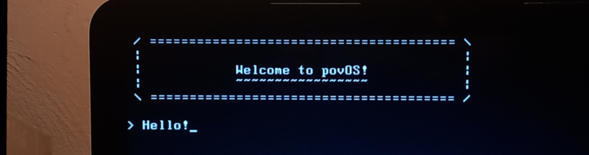

povOS is an operating system for an IBM-compatible PC using the x86_64
architecture.

- Author:  Giovanni Santini
- Mail:    giovanni.santini@proton.me
- License: MIT

## Features

- custom bootloader
- custom standard library
- drivers:
  - PS/2
  - UART
  - VGA
  - ISA
  - PIC (Programmable Interrupt Controller)
  - PIT (Programmable Interrupt Timer)
  - HPET (High Precision Event Timer)
  - Keyboard
  - ACPI
  - PCI/PCIe
  - [edu](https://www.qemu.org/docs/master/specs/edu.html)
- kernel:
  - IDT (Interrupt Descriptor Tabe) and ISR (Interrupt Service Routines)
  - input (supports multiple keyboard layouts)
  - textbuffer
  - framebuffer
  - console
  - tty
  - time tracking
  - sleep
  - memory management
    - physical memory management
    - paging
    - virtual memory manager
    - free-list based memory allocator
    - heap
  - multitasking
    - tasks
    - context switching
    - scheduler
  - random number generation

The implementation is clean and readable, headers are documentation.

## Usage

Compile and run with qemu:

```
make -B && make qemu
```

Compile and run with bochs:

```
make -B && make bochs
```

Run inside GDB (with debug info):

```
./scripts/debug x86_64
```

## The boot sequence

The BIOS boot sequence for x86_64 looks like this:

 - CPU starts executing in 16-bit real mode, with BIOS access
 - Use the bios to load the rest of the bootloader and kernel
 - Setup and load the GDT with a flat memory layout
 - Go to protected mode
 - Enable the A20 line
 - Setup GDT again
 - Setup the page table
 - Enable long mode
 - Call the main routine
