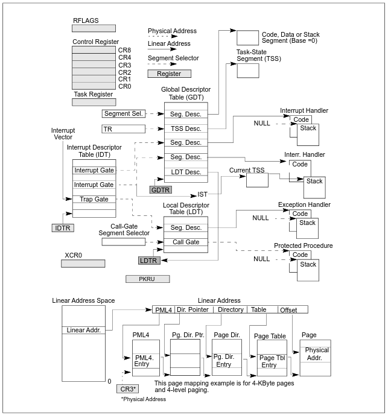

povOS is an operating system for the PC, with ACPI.

## Features

- custom bootloader
- custom standard library
- interrupts
- input (supports multiple keyboard layouts)
- textbuffer
- framebuffer
- console
- tty
- time tracking
- sleep
- memory management
  - physical memory management
  - paging
  - virtual memory manager
  - free-list based memory allocator
  - heap
  - higher half kernel, RAM mapped in high memory
- multitasking
  - tasks
  - context switching
  - scheduler
  - semaphores
  - mutexes
  - spinlocks
- filesystem
  - virtual filesystem
- random number generation
- logging
- drivers:
  - PS/2
  - UART
  - VGA
  - ISA
  - ATA
  - PIC (Programmable Interrupt Controller)
  - PIT (Programmable Interrupt Timer)
  - HPET (High Precision Event Timer)
  - Keyboard
  - ACPI
  - PCI/PCIe
  - [edu](https://www.qemu.org/docs/master/specs/edu.html)
  - IOAPIC

The implementation is clean and readable, headers are documentation.

General overview of the programming environment:




## Usage

Compile and run with qemu:

```
make -B && make qemu
```

Compile and run with bochs:

```
make -B && make bochs
```

Run inside GDB (with debug info):

```
./scripts/debug x86_64
```
