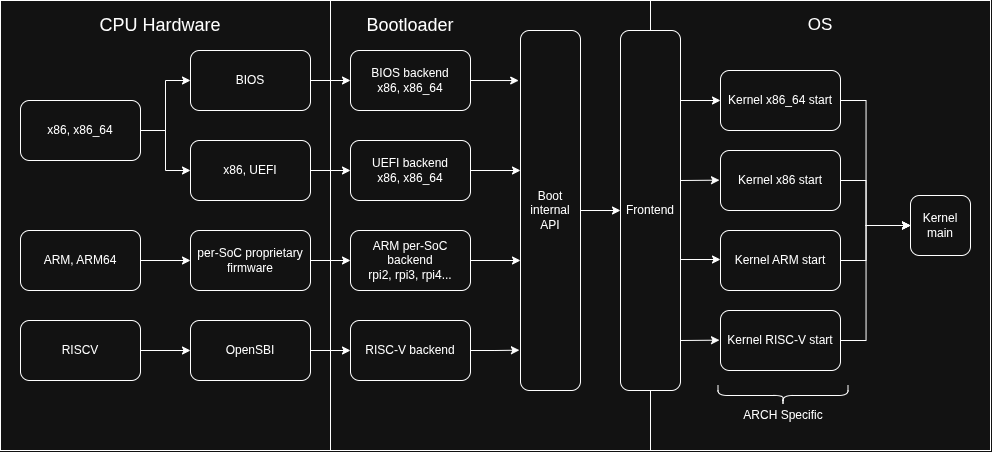

# TODO

Future plans for the operating system.

## Bootloader

I want to port the operating system to multiple architectures. It all
starts from the bootloader, I have to be able to boot from different
environments. Currently, only the x86_64 with BIOS boot architecture
is supported. To support more systems, I need to create a few
abstractions:

- Boot API: this is the API that the bootloader exposes to the
  kernel. Its implementation depends on the platform, but the kernel
  should expect to be loaded and executed in a known state. I could
  look at the Multiboot specification for inspiration.
- Kernel ARCH start: after the bootloader, a platform dependent
  initialization phase should start. This will initialize the key
  drivers and buses based on the architecture
- Generic kernel start: now the cross-platform kernel logic can start,
  and it can use cross-platform abstractions over the hardware such as
  for memory management and interrupts.

Here is an high-level overview of the boot process:

Todo, in order:

- have a well-defined bootloader to kernel API
- start with UEFI boot in x86_64
- then support BIOS x86 32 bit

## Scheduler

The current scheduler is a simple preentive Round Robin with a fixed
time "quantum", meaning that each process is divided equally
time-wise. A good addition would be to introduce priority queues with
some kind of penalty mechanism to avoid starvation, meaning that tasks
with higher priority will be executed first, then the ones with lower
priority, but if a process with high priority is taking too much time,
then the scheduler will go to the lower ones anyway (avoiding
starvation).

Another design that takes into account real time constraints would
also be nice to have.

## Kernel

- interrupt management framework: you should be able to mask, register
  and redirect interrupts in a driver-independent way
- general device model: bus, device, driver abstractions
- vfs: the VFS interface is already implemented, now a filesystem that
  uses it should be implemented too, like FAT32.
- testing framework
- shell: implement a small programming language like BASIC or Bash in
  the shell
- syscalls
- userspace
- have a `menuconfig`-like kernel configuration system
- use multiple cores?

## Drivers

- AHCI: modern standard to communicate with SATA devices
- SMBus: required for I2C, which is useful for emulated sensors
- VESA:  high resolution graphics, but we need to mess with the bootloader
- ACPI: DSDT

## Chores

- read-write lock
- power off: surprisingly, doing this right is a bit more complicated
  than you think. It may require some power management infrastructure.
- develop a custom emulated device in qemu, such as a temperature
  sensor using i2c
