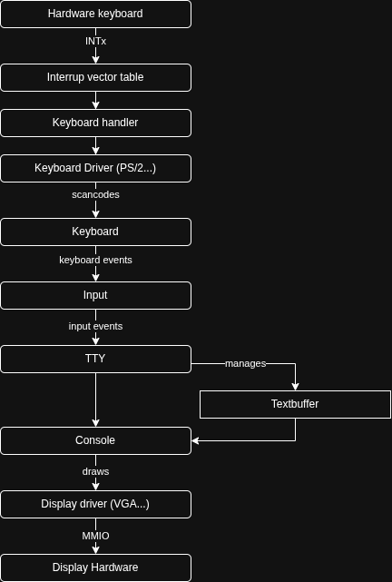
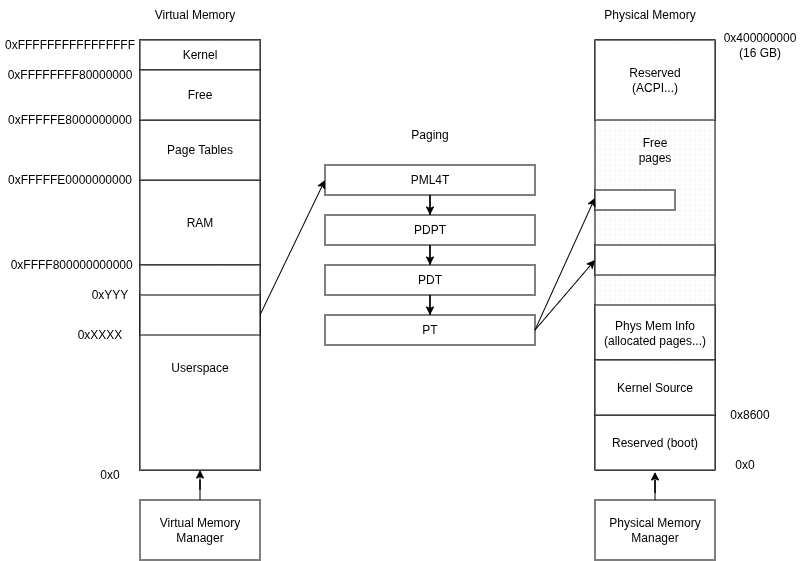

# OS Design

## Goals

The design goals of the operating system are the following:

- extreme portability: have a well-defind, as small as possible, platform
  abstraction. Ideally, you would have about 100 function that you would need
  to implement in order to port the entire operating system to another
  platform / architecture / SoC...

- swappable userspace interface: have custom userspaces. This may include an
  UNIX-compatible userspace, but also custom-designed ones that are not limited
  by old POSIX conventions. This will enable exploring new interfaces and ideas.

## Input

The input subsystem is the first subsystem I implemented. It is not
trivial at all because we need to handle multiple physical keyboards,
possibly using many different buses, with support for multiple
keyboard layouts and higher-level input events (you may want a
character stream instead of raw keycodes).

Here is the keyboard input stack, from the physical keyboard to the
display output:

## Virtual memory

Memory management is really tricky to work with, and a big part of it
the the virtual memory. We need a Virtual Memory Manager to allocate /
deallocate the virtual memory, then a Physical Memory Manager to do
the same for pages, and a translation mechanism implemented in
hardware (paging).

Here is a picture that visualizes this relationship:

